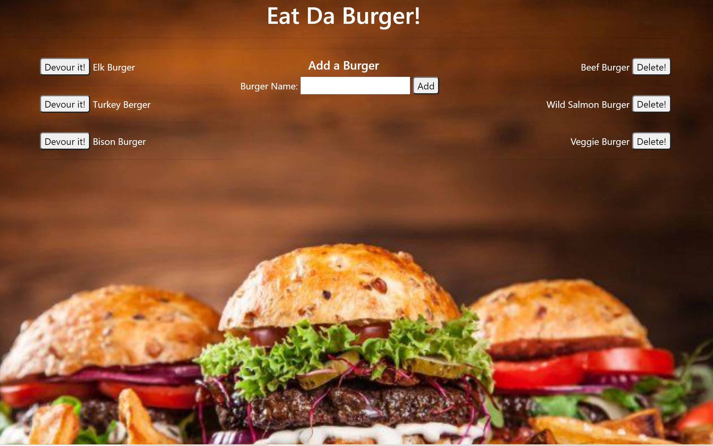

# Eat Da Burger

Eat-Da-Burger! is a restaurant app that lets users input the names of burgers they'd like to eat.

[Link to Webpage](https://enigmatic-waters-41603.herokuapp.com/)

## Table of Content
* [Description](#Description)

* [Installation](#Installation)

* [Question](#Question)

## Description
Creating a burger logger with MySQL, Node, Express, Handlebars and a homemade ORM.

  Whenever a user submits a burger's name, the app will display the burger on the left side of the page -- waiting to be devoured.

* Each burger in the waiting area also has a `Devour it!` button. When the user clicks it, the burger will move to the right side of the page.

* The app will store every burger in a database, whether devoured or not.
   

## Installation:
After download the project, run `npm install` in terminal. Do not forget to run it at the same directory which your downloaded folder is. Also, put your own username and password at `connection.js` file. Then, write `node server.js` to run! 

## Question?
If you have any question or require any further information, feel free to contact me. 

GitHub: https://github.com/karimi65

Email: ali216k@gmail.com
